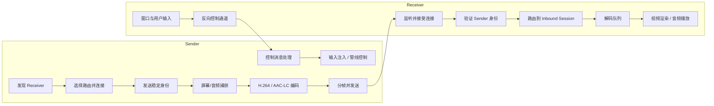
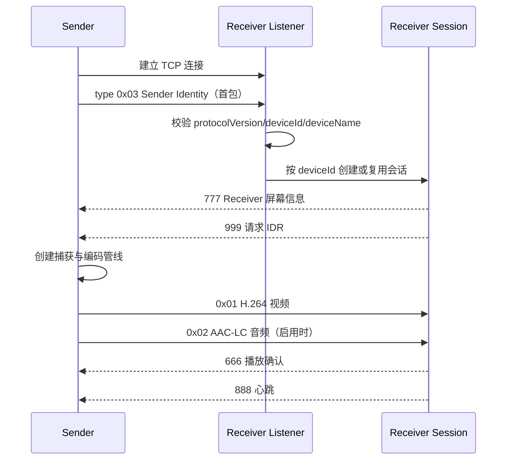
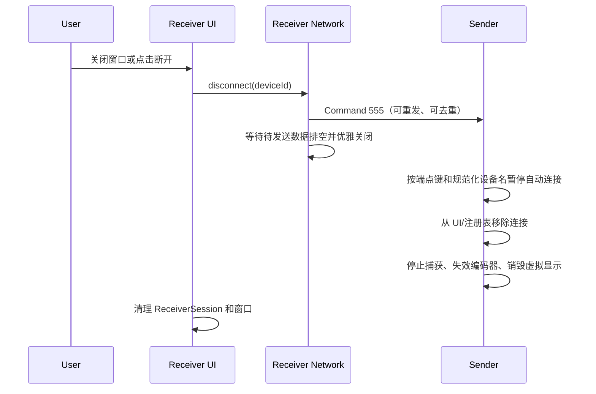

# ExtendCast Sender / Receiver 实现基线与跨平台一致性规范

> 状态：当前实现基线  
> 基准实现：macOS Sender + Windows Receiver  
> 协议版本：Sender Identity v1  
> 最后核对：2026-08-10

## 1. 文档目的

本文沉淀当前 macOS 发送端与 Windows 接收端已经落地的连接、传输、播放、控制、重连和断开逻辑，并将其中影响用户体验的行为定义为跨平台一致性要求。

后续新增 Windows、macOS、Linux、Android 或其他平台的 Sender / Receiver 时，应先满足本文的行为契约，再根据平台能力替换捕获、编码、解码、渲染和输入注入实现。

本文使用以下约束词：

- **必须**：不同平台不得产生可观察的行为差异。
- **应该**：允许因平台能力不同而调整，但需要说明原因。
- **可以**：实现细节，不构成兼容性要求。

线协议字段以 [Shared/Protocol/PROTOCOL.md](../Shared/Protocol/PROTOCOL.md) 为准；本文重点说明协议如何组成完整的产品行为。

相关概念命名以 [`CONTEXT.md`](../CONTEXT.md) 为准；Receiver Advertisement 的路由权威规则见 [ADR 0001](adr/0001-receiver-advertisement-is-route-authority.md)。

## 2. 角色与核心对象

Sender 与 Receiver 是独立角色，不等同于某个操作系统。一台设备可以只实现一个角色，也可以同时实现两个角色。

| 对象 | 含义 | 当前基准实现 |
| --- | --- | --- |
| Sender | 捕获本机显示内容，编码并向外发送音视频，同时消费 Receiver 的控制消息 | macOS `SenderViewModel` / `ConnectionPipeline` |
| Receiver | 监听入站连接，识别 Sender，解码、播放并向 Sender 发送控制消息 | Windows `NetworkListener` / `ReceiverSession` |
| Receiver Advertisement | Receiver 通过 mDNS 发布的可连接能力与端点 | `_bettercast._tcp` / `_bettercast._udp` |
| Outbound Route | Sender 连接某个 Receiver 的一条实际网络路径 | TCP、P2P、局域网、兼容连接等 |
| Outbound Stream | Sender 对一个 Receiver 独立维护的捕获、编码和发送管线 | 一个 `ConnectionPipeline` |
| Inbound Session | Receiver 按稳定 Sender 身份维护的播放会话 | 一个 `ReceiverSession` |

关键不变量：

1. 一个 Sender 可以同时连接多个 Receiver；每个 Receiver 使用独立管线和设置。
2. 一个 Receiver 可以同时接收多个 Sender；每个稳定 `deviceId` 对应一个会话和一个接收窗口。
3. 网络端点用于建立连接，稳定设备身份用于维护会话；不得用临时 IP、端口或 socket 代替设备身份。
4. “已连接”必须同时代表有效传输连接和存活的发送/接收管线，不能只反映窗口或列表状态。

## 3. 端到端架构



平台实现可以替换图中的任意内部组件，但身份、生命周期、控制命令和用户可见状态必须保持一致。

## 4. 服务发现与路由

### 4.1 当前发现协议

- TCP mDNS 服务类型：`_bettercast._tcp`
- UDP mDNS 服务类型：`_bettercast._udp`
- TCP 默认端口：`41820`
- UDP 默认端口：`51821`

`bettercast` 名称为历史兼容标识，不随产品品牌 ExtendCast 改名。

Sender 可以通过 mDNS、手工地址或兼容连接器获得端点。兼容连接器只改变“如何到达 Receiver”，不得改变双方角色，也不得伪造自动发现结果。

### 4.2 路由选择原则

当前 macOS Sender 会结合用户设置和可用网络，在自动、路由器网络、以太网、Thunderbolt、P2P、USB/Wi-Fi ADB 等路径中选择连接方式。具体网络框架属于平台实现，但所有平台必须遵守：

- 自动连接以逻辑 Receiver 为目标，而不是以某个瞬时 IP 为目标。
- 同一设备切换网络接口后，Receiver 应复用原会话和窗口。
- 地址变化、Bonjour 名称数字后缀或 P2P 名称变体不得绕过用户的主动断开抑制。
- 探活连接在未完成身份握手前不得影响 UI。

当前 Windows Receiver 的 UDP 媒体路径缺少与 TCP 等价的稳定身份准入，因此 **TCP 是当前跨平台功能一致性的生产基线**。UDP 在补齐身份、会话替换和主动断开语义前，不应宣称与 TCP 等价。

## 5. 建连与身份握手

### 5.1 正常时序



### 5.2 Sender Identity

每条 TCP 媒体连接的第一个业务消息必须是 `0x03` 身份包：

```json
{
  "protocolVersion": 1,
  "deviceId": "stable-device-uuid",
  "deviceName": "Studio Mac mini"
}
```

一致性要求：

- `deviceId` 必须持久化并跨应用重启、IP 变化和网络切换保持稳定。
- `deviceName` 用于展示，不作为唯一主键。
- Receiver 在身份验证通过前不得接收该连接的音视频，不得创建、关闭、聚焦或调整接收窗口。
- 同一 `deviceId` 建立新连接时，新连接替换旧连接，但沿用同一个会话、窗口位置和全屏状态。
- 身份版本不受支持或字段无效时，Receiver 应拒绝该媒体连接，并记录可诊断日志。

当前 macOS 使用保存在 `UserDefaults` 中的 UUID 作为稳定身份；Windows 使用 `InboundSessionRegistry` 将临时 connection ID 绑定到稳定 device ID。

## 6. 媒体协议与发送管线

### 6.1 TCP 分帧

每个消息使用大端长度与类型字节：

```text
[bodyLength: UInt32 BE] [type: UInt8] [payload]
```

| 类型 | 内容 |
| --- | --- |
| `0x01` | H.264 视频 |
| `0x02` | AAC-LC 音频 |
| `0x03` | Sender Identity JSON |

Windows Receiver 当前限制单包最大 8 MiB、连接缓冲最大 32 MiB，并在一次事件循环中最多排出 4 个 TCP 包，避免媒体解析长时间占用 UI / 网络线程。这些数值是当前实现参数，不是协议永久常量。

### 6.2 视频负载

视频 payload 为 25 字节固定头加 AVCC NAL 单元：

```text
[streamId: UInt64 BE]
[sequence: UInt64 BE]
[ptsNanoseconds: UInt64 BE]
[flags: UInt8]
[naluLength: UInt32 BE] [nalu] ...
```

- `flags & 0x01` 表示 IDR。
- 每次新建编码器必须生成新的非零 `streamId`，`sequence` 从 0 开始。
- PTS 是从 0 开始的流内单调时间，不是墙上时钟。
- 捕获时钟发生跳变时，Sender 必须重新锚定，不能在同一个 stream 内产生倒退 PTS。

当前 macOS Sender 为每个连接独立创建 `ScreenRecorder`、`VideoEncoder` 和 `StreamFeedbackController`。可选创建虚拟显示器；若启用了虚拟显示但创建失败，必须停止该管线，不能静默改为发送主屏幕。

编码分辨率和帧率受用户设置、Receiver 上报能力和展示容量共同约束。网络类型可以影响码率、关键帧周期和限速窗口，但不得改变协议语义。

### 6.3 音频

当前基线为 AAC-LC，macOS Sender 默认参数为 48 kHz、双声道、128 kbit/s、每包 1024 samples。音频可按连接单独启用或关闭。

未来实现若新增 codec，必须通过显式能力协商；不能在既有 `0x02` 类型下静默发送不兼容格式。

## 7. Receiver 会话、解码与展示

Windows Receiver 在身份准入后按 `deviceId` 路由音视频。每个 `ReceiverSession` 独立持有：

- 视频解码队列与解码线程；
- 视频解码器；
- D3D11 零拷贝呈现路径，及 OpenGL / 软件兼容回退；
- AAC 解码与音频播放；
- 接收窗口、全屏状态和输入处理器。

### 7.1 低延迟原则

Receiver 的目标是交互低延迟，不是补播所有历史帧：

- 以每个 `streamId` 的首帧 PTS 和本地单调时钟建立时间锚点。
- 队列落后时，丢弃到最新可安全解码的 IDR，并重置解码器。
- 若缓冲中没有新 IDR，丢弃过期完整包、发送 `999` 请求新 IDR，并在 IDR 到达前拒绝 P 帧。
- 不得从任意 P 帧恢复解码。

协议目标落后阈值为 500 ms。当前 Windows 解码队列按约 500 ms 控制；TCP 软呈现路径的追赶保护使用 800 ms，以减少热降频时频繁触发 IDR。平台可以调整保护参数，但最终播放延迟和恢复行为应通过一致性测试。

### 7.2 窗口身份

- 第一次识别某个 `deviceId` 时创建一个接收窗口。
- 同设备正常重连时复用窗口，不闪烁、不重复创建，并保持全屏状态。
- 仅网络异常时可以进入重连宽限期；当前普通连接为 3 秒，ADB 兼容连接为 30 秒。
- 用户主动断开时立即结束会话，不进入重连宽限期。

### 7.3 Windows D3D11 降级策略

Windows 的 D3D11VA 解码器和零拷贝 Presenter 共享同一个 D3D11 device 与
immediate context。FFmpeg 解码调用和 Presenter 对 context 的访问必须串行，
不能让两个线程同时操作 immediate context。

- 普通 swap chain、shader 或纹理管线失败时，Receiver 切换到 OpenGL 展示；
  若 D3D11VA device 仍健康，可以保留硬件解码并将帧转到系统内存。
- 出现 device removed、reset、hung 或 driver internal error 时，必须把共享
  device 标记为进程级失效。当前及后续会话在本次进程生命周期内都不得继续
  创建或使用 D3D 硬解资源。
- 设备丢失恢复期间必须停止接收旧视频包、清空待解码队列、重置为软件解码，
  再等待并请求新的 IDR；不得拿失效 device 产生的引用继续展示。
- 播放确认只能在 `Present` 成功且画面未被标记为 occluded 后发送。复制失败、
  `DXGI_ERROR_WAS_STILL_DRAWING`、Present 失败或遮挡状态都不能确认该帧已显示。
- 为避免仍存活的 FFmpeg frame 引用访问新旧混合资源，当前基线不在运行中热建
  共享 D3D device；用户重启 Windows Receiver 后才重新尝试硬件路径。

`EXTENDCAST_DISABLE_ZERO_COPY=1` 只强制使用 OpenGL 展示，不等同于禁用
D3D11VA 解码，可用于单独验证非零拷贝展示路径。

## 8. Receiver 到 Sender 的反向控制

反向控制使用四字节大端长度前缀加 JSON `InputEvent`，不带媒体类型字节。事件包含类型、坐标/按键数据，并可包含 `eventId`、stream ID 和时间戳。

| `type` | 含义 |
| --- | --- |
| `0` | 鼠标移动 |
| `1` / `2` | 左键按下 / 抬起 |
| `3` / `4` | 右键按下 / 抬起 |
| `5` / `6` | 按键按下 / 抬起 |
| `7` | 滚动 |
| `99` | 内部命令 |

内部命令：

| `keyCode` | 含义 | 必须行为 |
| --- | --- | --- |
| `555` | Receiver 用户主动断开 | Sender 停止对应管线并抑制自动重连 |
| `666` | 播放确认 | Sender 更新端到端反馈与节奏控制 |
| `777` | Receiver 屏幕信息 | Sender 更新分辨率/物理尺寸能力 |
| `888` | 心跳 | Sender 更新连接存活时间 |
| `999` | 请求关键帧 | Sender 对对应连接强制生成 IDR |

Windows 会对关键控制事件重复发送 3 次，并通过 `eventId` 支持去重。所有命令处理必须幂等，例如重复收到 `555` 不能导致崩溃、错误地影响其他连接或重新创建管线。

当前 Sender 的心跳判定为：网络路径不可用时约 5 秒超时；路径仍可用时约 15 秒超时。Receiver 当前约每 500 ms 发送一次心跳。

## 9. 断开与重连语义

这是跨平台最重要的行为契约。实现不得只“关闭窗口”或只“关闭 socket”，而必须沿统一生命周期结束对应的 Sender 管线和 Receiver 会话。

### 9.1 场景矩阵

| 场景 | Sender 行为 | Receiver 行为 | 是否自动重连 |
| --- | --- | --- | --- |
| 短暂断网、接口切换、进程异常退出 | 停止失效连接；若该 Receiver 开启自动连接则允许重试 | 进入有限重连宽限期，保留窗口与全屏状态 | 允许 |
| Sender 用户点击断开 | 先标记该 Receiver 自动连接暂停，再销毁对应管线和连接 | 收到连接结束后关闭对应会话 | 不允许立即重连 |
| Receiver 托盘菜单点击断开 | 收到 `555` 后暂停自动连接并销毁对应管线 | 发送 `555`，优雅关闭传输，再清理会话 | 不允许立即重连 |
| Receiver 接收窗口关闭 | 与托盘断开完全相同 | 走同一个统一断开入口 | 不允许立即重连 |
| Receiver 停止监听或退出应用 | 按连接异常结束；保留用户原有自动连接配置 | 停止监听并清理会话 | Receiver 再次可用后可按配置重连 |
| 用户在 Sender 手工发起连接 | 清除该 Receiver 的暂停标记并连接 | 正常准入 | 允许 |
| 用户关闭再开启该 Receiver 的自动连接 | 清除暂停标记，恢复策略 | 无特殊处理 | 允许 |

### 9.2 Receiver 主动断开的标准时序



顺序约束：

1. Receiver 必须先发 `555`，再优雅关闭传输。
2. Sender 收到 `555` 后必须先建立自动重连抑制，再移除连接。
3. Sender 必须停止音视频发送、释放捕获/编码资源并更新 UI；只改变连接状态文字是不完整实现。
4. Receiver 的窗口关闭与托盘断开必须调用同一业务入口，不能各自维护一套清理逻辑。
5. 主动断开不得进入“等待自动重连”的宽限状态。

### 9.3 自动连接暂停范围

当前 macOS 基线同时按 Receiver profile key 和规范化 Bonjour 设备名抑制自动连接，以覆盖端口变化、接口切换和名称数字后缀变化。暂停保存在 Sender 当前进程内：手工连接、关闭后重新开启自动连接，或重启 Sender 应用会恢复自动连接资格。

未来平台必须至少做到：用户主动断开后，在当前运行周期内不会因发现回调、网络切换或地址变化立即自动连回去。

## 10. 状态模型与 UI 一致性

### 10.1 Sender 状态

```text
Discovered -> Connecting -> Connected -> Disconnecting -> Disconnected
                  |             |
                  |             +-> Recovering -> Connecting
                  +----------------> Failed
```

- `Connected`：传输已就绪且该连接的媒体管线存在。
- `Recovering`：仅用于非用户主动断开的可恢复异常。
- `Disconnected`：注册表、UI、网络连接和媒体资源已完成或已安排确定性清理。

### 10.2 Receiver 状态

```text
Listening -> Unidentified -> Identified/Receiving
                                 |          |
                                 |          +-> ReconnectGrace -> Receiving
                                 |                            +-> Closed
                                 +-> IntentionalDisconnect ------> Closed
```

- `Unidentified` 不得产生接收窗口或“已连接”设备。
- `ReconnectGrace` 只服务于意外断开。
- `IntentionalDisconnect` 必须发送 `555` 并直接结束会话。

### 10.3 用户可见要求

- Sender 与 Receiver 展示的连接状态必须最终一致；不允许一端显示未连接而另一端仍持续发送。
- Receiver 的每个活动连接都应显示稳定设备名，并提供全屏和断开操作。
- 全屏只改变展示方式，不改变网络会话或自动连接策略。
- 同设备重连后应保持原窗口位置与全屏状态；不同 `deviceId` 不得复用同一窗口。
- 错误提示应区分身份失败、网络失败、捕获失败、编码/解码失败和用户主动断开。

## 11. 多设备并发与资源隔离

每条连接必须独立持有以下状态：

- 网络连接及其路由偏好；
- Sender 的捕获目标、虚拟显示、编码器、音频开关和反馈控制器；
- Receiver 的解码器、队列、窗口、全屏状态和音频播放器；
- 心跳、PTS 锚点、stream ID、关键帧等待状态；
- 自动连接设置与主动断开暂停状态。

断开设备 A 不得停止设备 B 的捕获、关闭设备 B 的窗口、清空设备 B 的输入映射或改变设备 B 的自动连接配置。

## 12. 异常恢复规则

- **连接丢失**：Receiver 可保留会话窗口进入宽限期；Sender 仅在开启自动连接且未被主动断开抑制时重试。
- **连接替换**：同 `deviceId` 的新连接原子替换旧 socket，媒体事件继续进入原会话。
- **关键帧丢失**：Receiver 请求 IDR 并等待，不从 P 帧硬恢复。
- **捕获无首帧**：当前 macOS 在启动后 2 秒仍无视频帧时重建管线，并进行上限 4 秒的指数退避恢复。
- **虚拟显示创建失败**：停止该连接的发送启动，不能回退为意外共享主屏幕。
- **硬件解码不可用**：Receiver 可以回退到软件路径，但必须保持颜色、方向、时序和断开语义一致。
- **重复控制消息**：依靠 `eventId` 去重并保持命令幂等。

## 13. 新平台实现清单

### 13.1 新 Sender

- [ ] 持久化稳定 `deviceId`，连接后首包发送 Identity v1。
- [ ] 为每个 Receiver 创建隔离的发送管线。
- [ ] 按协议生成 stream ID、sequence、单调 PTS 和 IDR 标记。
- [ ] 支持 `555/666/777/888/999` 控制命令并保证幂等。
- [ ] 将 Receiver 主动断开与普通网络异常分开处理。
- [ ] 主动断开后停止捕获、编码、音频和网络发送。
- [ ] 自动连接不会绕过主动断开暂停。
- [ ] 多 Receiver 并发时设置和资源互不污染。

### 13.2 新 Receiver

- [ ] 发布兼容的 mDNS 服务与端口能力。
- [ ] Identity 验证前不准入媒体、不创建 UI。
- [ ] 按稳定 `deviceId` 建立一个会话和一个窗口。
- [ ] 同设备重连替换连接并保持窗口/全屏状态。
- [ ] 实现视频时序、过期帧追赶、IDR 请求和音频播放。
- [ ] 定期发送心跳、播放确认和屏幕能力。
- [ ] 窗口关闭与菜单断开走同一入口，并先发送 `555`。
- [ ] 只有意外断开进入重连宽限期。
- [ ] 多 Sender 并发时会话和资源互不污染。

## 14. 跨平台验收用例

每组新 Sender + Receiver 组合至少验证：

1. 首次发现、手工连接、首帧、音频和输入控制。
2. Receiver 自动连接开启时，Receiver 主动断开后 30 秒内不会被发现事件重新连上。
3. Receiver 关闭接收窗口与菜单断开产生完全相同的结果：Sender 停止发送且双方均显示未连接。
4. Sender 主动断开后不会立即自动连接；手工连接可以恢复。
5. 同一 Sender 从 Wi-Fi 切换到其他接口，只保留一个 Receiver 窗口并保持全屏状态。
6. 未发送身份的探活 socket 不创建、不关闭、不聚焦窗口。
7. 同一设备快速重连时新连接替换旧连接，不产生重复会话。
8. 注入丢帧后 Receiver 从 IDR 恢复，不长时间播放陈旧画面。
9. 终止 Receiver 进程后 Sender 安全停止或重试，不发生捕获/编码资源崩溃。
10. 同时连接至少两个设备，断开其中一个不影响另一个。
11. 重复发送 `555` 和 `999`，双方状态仍正确且无重复资源释放。
12. 全屏、退出全屏、自定义标题栏按钮和托盘按钮只影响目标会话。

建议自动化断言至少覆盖：身份注册与连接替换、主动/意外断开分流、自动连接抑制、视频队列追赶、输入事件去重和多会话隔离。

## 15. 当前已知边界与后续演进

1. UDP 尚未具备与 TCP 相同的稳定身份准入和完整会话语义，目前不属于一致性基线。
2. `_bettercast.*` 是兼容性名称；修改会破坏既有发现，不能只在单平台改名。
3. `555` 等数字命令目前分别定义在 Swift 与 C++ 中。新增命令时必须同步更新两端常量、线协议、本文和互操作测试。
4. 码率、关键帧周期、队列长度、硬件解码路径属于可调策略；稳定身份、主动断开和 UI 状态属于不可分叉的产品契约。
5. 修改断开流程时，必须同时回归 Sender 菜单、Receiver 托盘、Receiver 窗口关闭、网络异常和应用退出五条路径。

## 16. 当前代码索引

| 主题 | 主要实现 |
| --- | --- |
| macOS 连接、自动连接、管线与断开 | `macOS/Sources/BetterCastSender/BetterCastSenderApp.swift` |
| macOS 稳定身份 | `macOS/Sources/BetterCastSender/SenderIdentity.swift` |
| macOS 视频/音频编码 | `VideoEncoder.swift`、`AudioEncoder.swift`、`ScreenRecorder.swift` |
| macOS 输入与命令处理 | `InputEvent.swift`、`InputHandler.swift` |
| Windows 网络准入与控制发送 | `Desktop/NetworkListener.h/.cpp` |
| Windows 会话注册 | `Desktop/InboundSessionRegistry.h` |
| Windows Receiver 会话 | `Desktop/ReceiverSession.h/.cpp` |
| Windows 统一窗口/托盘断开入口 | `Desktop/MainWindow.h/.cpp` |
| Windows 解码与展示 | `VideoDecoder.*`、`D3D11VideoPresenter.*`、`VideoRenderer.*` |
| 跨平台线协议 | `Shared/Protocol/PROTOCOL.md` |

## 17. 变更治理

凡是改变以下任一内容的提交，都必须更新本文或线协议，并补充对应测试：

- 身份字段、媒体帧格式或控制命令；
- 自动连接、重连宽限期或主动断开行为；
- “已连接”的判断条件；
- 同设备连接替换与窗口复用规则；
- codec、时间戳、关键帧恢复策略；
- Sender / Receiver 用户入口之间的统一生命周期。

代码实现、协议文档和验收用例三者必须同时成立，才能认为某个平台达到了 Sender / Receiver 体验一致。
